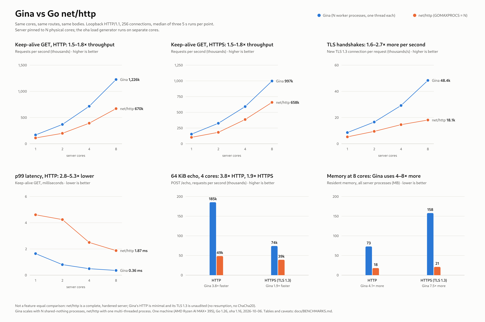

# Benchmarks

Measured 2026-10-06. Reproduce with `bench/run.sh` (about 10 minutes) and `bench/summarize.py bench/results.csv`; raw data is in [bench/results.csv](../bench/results.csv).

**Read the caveats at the bottom before quoting any number.**

*Figure: regenerate with `python3 bench/plot.py` (reads `bench/results.csv`; a dark variant `results-dark.png` is produced too). The tables below are the table view of the same data.*

## Setup

| | |
|---|---|
| Machine | AMD Ryzen AI MAX+ 395, 16 cores / 32 threads (SMT), two core complexes, Linux 7.2, Go 1.26, CPU governor `powersave` |
| Server | confined with `taskset` to physical cores `0..N-1` (SMT siblings left idle) |
| Load generator | `oha` 1.16, confined to physical cores 8-15 (the other complex), so it never shares a core with the server |
| Gina | `examples/httpserver`, **N worker processes** (`gina.Prefork`, one single-threaded shard each, `SO_REUSEPORT`); N=1 runs a single process |
| Baseline | Go `net/http` (`bench/nethttp`, a separate module because it uses goroutines), `GOMAXPROCS=N`, same routes and bodies, HTTP/1.1 only, TLS 1.3 only, ECDSA P-256, session tickets disabled |
| Both servers get | the same N cores. 256 concurrent connections (64 for the echo test), 1 s warm-up, then 3 runs of 5 s; the **median** run is reported |
| Traffic | loopback, HTTP/1.1, `GET /hello/bench` (14-byte body); the TLS rows use `--insecure` against a self-signed certificate |

## Microbenchmarks (one core, `go test -bench`, 3 runs, spread under 1%)

| Benchmark | Result |
|---|---|
| Cross-shard ping-pong (2 messages, 2 isolate turns) | 92 ns, **0 allocs** |
| Isolate spawn + first message + exit + teardown | 52 ns, **0 allocs** |
| HTTP request parse (6 headers) | 199 ns, 683 MB/s, **0 allocs** |
| TLS server flight, ECDSA P-256 (X25519 key exchange, key schedule, sign) | 82 µs, 297 allocs |
| TLS server flight, Ed25519 | 77 µs |
| TLS server flight, RSA-2048 | 670 µs (8.2x ECDSA) |
| TLS record layer, AES-128-GCM seal + open, 16 KiB | 4.3 µs, 3.8 GB/s |
| TLS record layer, AES-256-GCM | 4.8 µs, 3.4 GB/s |

The spawn benchmark found a real allocation (the init-args slice escaped and dragged the whole spawn spec to the heap); it was fixed (85 ns, 1 alloc before).

## Gina vs net/http

#### Keep-alive GET (14-byte response) - HTTP

| cores | Gina req/s | net/http req/s | Gina / net/http | Gina p50 / p99 (ms) | net/http p50 / p99 (ms) | Gina RSS | net/http RSS | failed (G / N) |
|---:|---:|---:|---:|---|---|---:|---:|---|
| 1 | 168,339 | 111,225 | 1.51x | 1.50 / 1.64 | 2.27 / 4.61 | 11 MB | 17 MB | 0 / 0 |
| 2 | 368,915 | 199,446 | 1.85x | 0.69 / 0.80 | 1.19 / 4.24 | 24 MB | 17 MB | 0 / 0 |
| 4 | 715,690 | 392,427 | 1.82x | 0.35 / 0.49 | 0.56 / 2.50 | 40 MB | 17 MB | 0 / 0 |
| 8 | 1,225,828 | 670,246 | 1.83x | 0.20 / 0.36 | 0.28 / 1.87 | 73 MB | 18 MB | 0 / 0 |

#### Keep-alive GET (14-byte response) - HTTPS (TLS 1.3)

| cores | Gina req/s | net/http req/s | Gina / net/http | Gina p50 / p99 (ms) | net/http p50 / p99 (ms) | Gina RSS | net/http RSS | failed (G / N) |
|---:|---:|---:|---:|---|---|---:|---:|---|
| 1 | 153,252 | 102,230 | 1.50x | 1.63 / 2.22 | 2.45 / 4.76 | 33 MB | 22 MB | 0 / 0 |
| 2 | 325,587 | 181,767 | 1.79x | 0.78 / 1.07 | 1.29 / 5.37 | 60 MB | 23 MB | 0 / 0 |
| 4 | 591,223 | 385,705 | 1.53x | 0.41 / 0.69 | 0.59 / 2.38 | 90 MB | 24 MB | 0 / 0 |
| 8 | 997,396 | 658,048 | 1.52x | 0.25 / 0.45 | 0.30 / 1.77 | 158 MB | 21 MB | 0 / 0 |

#### New connection per request (connection setup / TLS handshake bound) - HTTP

| cores | Gina req/s | net/http req/s | Gina / net/http | Gina p50 / p99 (ms) | net/http p50 / p99 (ms) | Gina RSS | net/http RSS | failed (G / N) |
|---:|---:|---:|---:|---|---|---:|---:|---|
| 1 | 52,802 | 45,310 | 1.17x | 4.26 / 11.87 | 5.62 / 8.92 | 18 MB | 13 MB | 0 / 0 |
| 2 | 75,370 | 81,738 | 0.92x | 3.04 / 10.19 | 3.02 / 7.80 | 37 MB | 15 MB | 0 / 0 |
| 4 | 218,802 | 144,896 | 1.51x | 0.82 / 4.13 | 1.62 / 4.95 | 73 MB | 15 MB | 0 / 0 |
| 8 | 257,171 | 140,876 | 1.83x | 0.88 / 3.17 | 1.71 / 3.52 | 131 MB | 17 MB | 0 / 0 |

#### New connection per request (connection setup / TLS handshake bound) - HTTPS (TLS 1.3)

| cores | Gina req/s | net/http req/s | Gina / net/http | Gina p50 / p99 (ms) | net/http p50 / p99 (ms) | Gina RSS | net/http RSS | failed (G / N) |
|---:|---:|---:|---:|---|---|---:|---:|---|
| 1 | 8,551 | 5,281 | 1.62x | 29.79 / 32.89 | 46.53 / 107.31 | 34 MB | 20 MB | 0 / 0 |
| 2 | 16,590 | 9,472 | 1.75x | 15.99 / 32.84 | 25.85 / 68.38 | 54 MB | 15 MB | 0 / 0 |
| 4 | 29,195 | 14,590 | 2.00x | 7.62 / 27.15 | 17.08 / 55.57 | 86 MB | 16 MB | 0 / 0 |
| 8 | 48,356 | 18,124 | 2.67x | 4.04 / 18.89 | 15.45 / 39.81 | 161 MB | 17 MB | 0 / 0 |

#### POST /echo with a 64 KiB body, keep-alive - HTTP

| cores | Gina req/s | net/http req/s | Gina / net/http | Gina p50 / p99 (ms) | net/http p50 / p99 (ms) | Gina RSS | net/http RSS | failed (G / N) |
|---:|---:|---:|---:|---|---|---:|---:|---|
| 4 | 185,454 | 48,568 | 3.82x | 0.34 / 0.53 | 0.30 / 6.19 | 78 MB | 17 MB | 0 / 0 |

#### POST /echo with a 64 KiB body, keep-alive - HTTPS (TLS 1.3)

| cores | Gina req/s | net/http req/s | Gina / net/http | Gina p50 / p99 (ms) | net/http p50 / p99 (ms) | Gina RSS | net/http RSS | failed (G / N) |
|---:|---:|---:|---:|---|---|---:|---:|---|
| 4 | 74,192 | 39,140 | 1.90x | 0.83 / 1.27 | 0.33 / 8.66 | 111 MB | 18 MB | 0 / 0 |

Memory is RSS summed over all server processes at the end of the run.

## What the numbers say

- **Keep-alive throughput: Gina is about 1.5-1.85x net/http** at every core count, HTTP and HTTPS, and scales almost linearly (168k to 1.23M req/s from 1 to 8 cores) because each core runs an independent process. Gina's **p99 is 3-6x lower** (for example 0.36 ms vs 1.87 ms at 8 cores) since a shard never contends for a scheduler or locks.
- **Large bodies:** a 64 KiB echo is **3.8x** faster on plain HTTP and **1.9x** over TLS, with a far better p99. net/http's p50 is slightly lower; its tail is not.
- **TLS handshakes** (new connection per request): Gina completes **1.6-2.7x** as many as net/http, about 8.5k/s per core and 48k/s on 8 cores. This is almost entirely ECDSA signing plus key exchange (82 µs measured above); the ratio grows with cores because net/http stops scaling around 18k/s here.
- **Plain connection setup:** roughly on par (0.9-1.8x) and **noisy**: Gina's run-to-run spread reached 1.35x. This workload is dominated by the kernel's accept/SYN path, and Gina's listener accepts one connection per scheduler tick per shard, a known limit that a batching accept loop would remove.
- **Memory: Gina uses more.** An idle Gina worker is about 7 MB (its own Go runtime and heap), so 8 workers cost about 56 MB before any traffic; under load it reached 73 MB (HTTP) and 158 MB (HTTPS) against about 18-25 MB for net/http. This is inherent to process-per-core; `MaxConns` sizing is not the cause (idle RSS is 6-7 MB at 256 or 4096). Choose fewer, busier workers if memory matters.

## Caveats

- **Not a feature-equal comparison.** `net/http` is a hardened, complete server (chunked bodies, `Expect: 100-continue`, HTTP/2 elsewhere, years of edge-case fixes). Gina's HTTP is deliberately minimal: no chunked request bodies, no HTTP/2, a hand-written parser and a TLS 1.3 implementation that has had no security audit and lacks resumption and ChaCha20. Some of the speed is the missing generality.
- **Different concurrency models.** Gina uses N shared-nothing processes (no shared cache or state between workers); `net/http` is one process with a goroutine per connection. Equal cores, not equal architecture.
- **Short, single-machine, loopback runs.** Three 5-second runs per configuration on one box with the load generator on the same machine. Run-to-run spread was a median of 2.5% (worst 1.35x on connection-setup rows). The `net/http` TLS rows were re-measured about 15 minutes after the Gina rows (to disable session tickets) and keep-alive numbers drifted by about 10% between sessions, so treat ratios as +/-10-15%.
- **The load generator is near, not at, its limit.** At 1.2M req/s `oha` used about 9 of its 16 threads, so the highest Gina rows may be slightly client-limited (a lower bound).
- **One workload.** Tiny responses, 256 connections, ECDSA certificates, no application work in the handler, no real network. CPU frequency scaling was not controlled (`powersave` governor).
